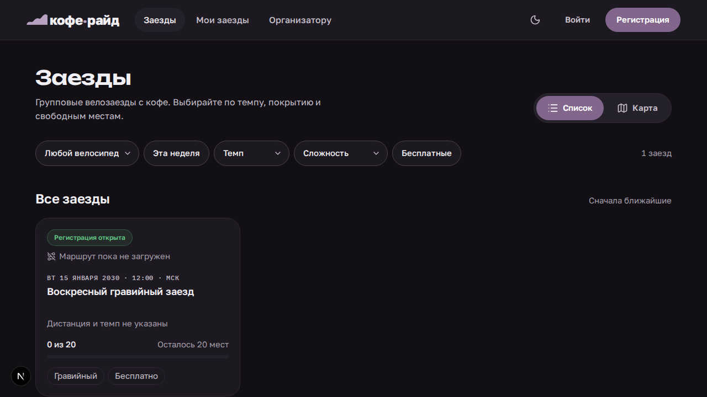
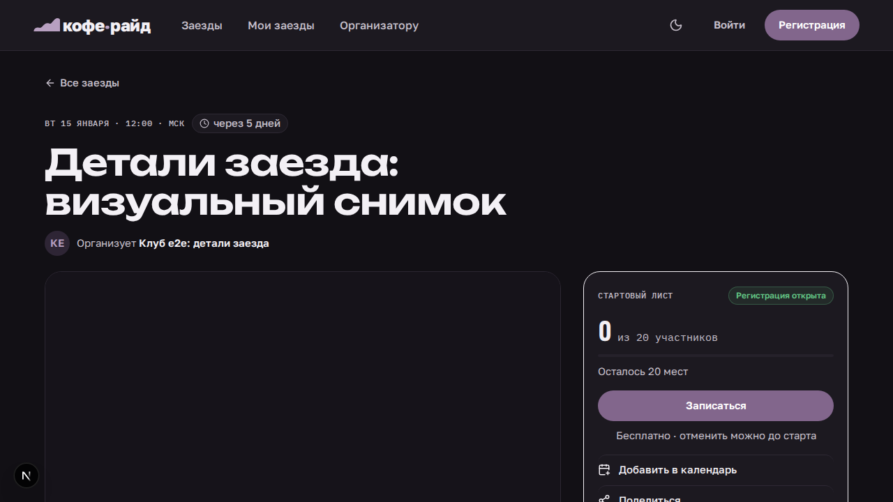
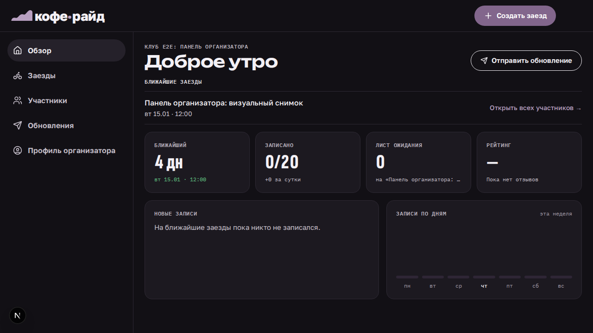
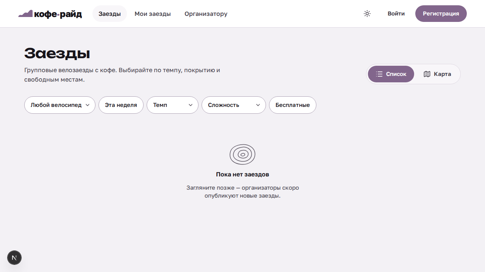
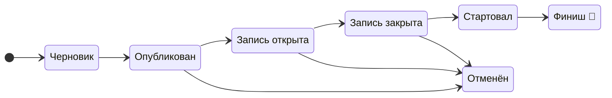
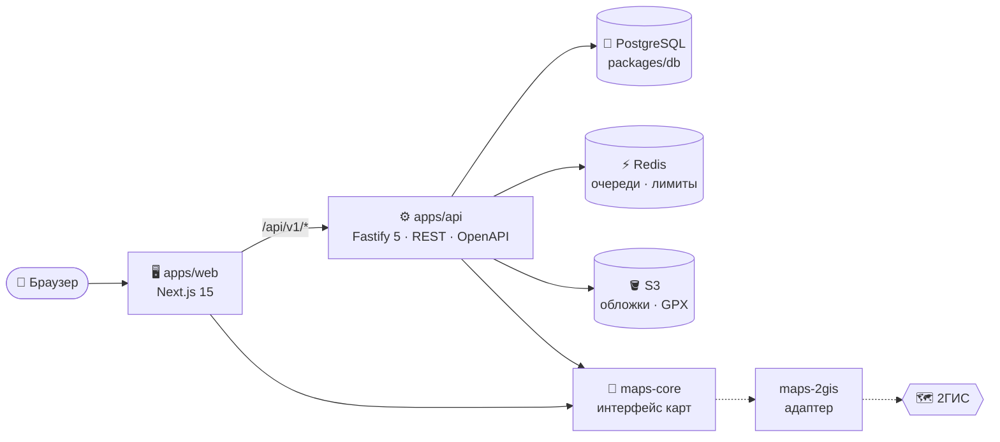

<a id="top"></a>

<div align="center">

<picture>
  <source media="(prefers-color-scheme: dark)" srcset="docs/assets/readme/hero-dark.svg">
  
</picture>


[](https://github.com/ipoderator/coffee_ride_app/actions/workflows/ci.yml)


**[О проекте](#about)** ·
**[Возможности](#features)** ·
**[Скриншоты](#screens)** ·
**[Быстрый старт](#quick-start)** ·
**[Архитектура](#architecture)** ·
**[Claude Code](#claude-code)** ·
**[Документация](#docs)**

</div>

---

<a id="about"></a>

##  О проекте

**Кофе-райд** — российская платформа для групповых велозаездов. Организатор за несколько
минут собирает заезд: маршрут на карте 2ГИС, остановки, сервисы, требования и лимит
участников. Райдер находит заезд под свой темп и велосипед, записывается в один клик и
получает обновления до самого старта. А после финиша — оставляет отзыв ☕

> [!NOTE]
> Проект в активной разработке: MVP реализован целиком, впереди первый боевой деплой.
> Актуальный срез — в [`project-state.md`](.claude/context/project-state.md), история — в
> [`docs/changelog.md`](docs/changelog.md).

<a id="features"></a>

##  Возможности

<table>
<tr>
<th width="50%">🙋 Участнику</th>
<th width="50%">📣 Организатору</th>
</tr>
<tr valign="top">
<td>

- 🔎 Каталог заездов списком и **на карте**
- 🎛 Фильтры: велосипед, неделя, темп, сложность, бесплатные
- 🗺 Маршрут, профиль высот, остановки и сервисы
- ✅ Запись в один клик и **лист ожидания**, если мест нет
- 🔔 Обновления от организатора во входящих
- 🚲 Гараж: свои велосипеды
- ⭐ Отзывы после финиша

</td>
<td>

- 🏁 Создание заезда: черновик → публикация → старт → финиш
- 🧭 Конструктор маршрута по точкам или загрузка GPX
- ☕ Остановки, сервисы (кофе, механик, сопровождение…) и требования
- 👥 Группы по темпу внутри одного заезда
- 📋 Участники, лист ожидания, отметки финиша
- 📨 Рассылка обновлений всем записавшимся
- 📊 Панель с ближайшими заездами и записями по дням

</td>
</tr>
</table>

<a id="screens"></a>

##  Как это выглядит

<div align="center">

<sub>Каталог заездов — фильтры по велосипеду, темпу и сложности, список или карта</sub>
</div>

<details>
<summary><b>📸 Ещё экраны — карточка заезда, кабинет организатора, светлая тема</b></summary>
<br>

|                           Карточка заезда                            |                               Кабинет организатора                               |
| :------------------------------------------------------------------: | :------------------------------------------------------------------------------: |
|  |  |

<div align="center">
<br>
<sub>Светлая тема. Скриншоты — эталоны визуальных тестов Playwright, данные тестовые.</sub>
</div>
</details>

### 🔄 Жизненный цикл заезда



<a id="quick-start"></a>

##  Быстрый старт

> [!TIP]
> Нужны **Node 24** (`.nvmrc`), **pnpm 10** и **Docker** — он поднимает Postgres, Redis и
> S3-хранилище (SeaweedFS).

```bash
nvm use && corepack enable           # Node 24 + pnpm
pnpm install                         # заодно ставит pre-commit хук Husky
cp .env.example .env                 # локальные настройки
pnpm infra:up                        # Postgres, Redis, S3 в Docker
pnpm --filter db db:migrate          # миграции базы
pnpm dev                             # web → :3000, api → :4000
```

| Что                  | Где                          |
| -------------------- | ---------------------------- |
| 🌐 Приложение        | <http://localhost:3000>      |
| ⚙️ API               | <http://localhost:4000/v1>   |
| 📘 Swagger / OpenAPI | <http://localhost:4000/docs> |

<details>
<summary><b>🧪 Демо-данные: 3 организатора, 8 райдеров, 9 заездов во всех статусах</b></summary>
<br>

При запущенном `pnpm dev`:

```bash
pnpm seed:demo              # пересоздаёт демо-аккаунты и заезды через API
pnpm seed:demo --no-routes  # без маршрутов — если 2ГИС недоступен
```

| Роль         | Логин                                                           | Пароль                  |
| ------------ | --------------------------------------------------------------- | ----------------------- |
| Организаторы | `org.north@`, `org.gravel@`, `org.coffee@demo.coffeeride.local` | `demo-coffee-ride-2026` |
| Райдеры      | `rider.anna@demo.coffeeride.local` и ещё 7                      | `demo-coffee-ride-2026` |

Скрипт можно запускать сколько угодно раз — в том числе после прерванного запуска.
Завершённые заезды получают отметки финиша, «сошёл», неявку и отзывы.
</details>

<details>
<summary><b>🩺 Если что-то не работает</b></summary>
<br>

- **«Загрузка недоступна»** — не запущено S3-хранилище. Поднимите его вместе с
  инициализацией бакета: `docker compose up -d s3 s3-init`. Проверка: `GET /health` → `s3`.
- **Нет маршрутов на карте** — API должен достучаться до 2ГИС; ключи — в `.env`
  (`MAPS_2GIS_API_KEY`, `NEXT_PUBLIC_MAPS_2GIS_MAPGL_KEY`). Без ключа карта показывает
  заглушку, остальное работает.
- **`pnpm infra:down`** останавливает инфраструктуру.

</details>

##  Стек

<div align="center">


<br>


<br>


</div>

<a id="architecture"></a>

##  Архитектура

Модульный монолит в монорепозитории pnpm + Turborepo. Браузер ходит только в `web`,
а тот проксирует `/api/v1/*` в `api` — один origin, без CORS.



<details>
<summary><b>📦 Что лежит в репозитории</b></summary>
<br>

```text
apps/
  web/            Next.js: каталог, страница заезда, кабинеты участника и организатора
  api/            Fastify: бизнес-правила, авторизация, REST /v1 + OpenAPI
packages/
  db/             Drizzle-схема, миграции, клиент, демо-сид
  types/          общие типы и контракты API
  ui/             дизайн-система: токены, компоненты, терминология
  maps-core/      провайдер-независимый интерфейс карт
  maps-2gis/      адаптер 2ГИС — единственный, кто знает про SDK
  resilience/     таймауты, ретраи, circuit breaker для внешних сервисов
  config/         общие настройки ESLint / TS / Vitest
deploy/ load/     прод-сборка (Caddy, smoke) и нагрузочные тесты k6
docs/             продукт, архитектура, API, БД, дизайн, ADR, задачи
.claude/          правила, скиллы, агенты и память для Claude Code
```

</details>

<details>
<summary><b>🧠 Ключевые решения</b></summary>
<br>

| Решение                                            | Зачем                                                                              |
| -------------------------------------------------- | ---------------------------------------------------------------------------------- |
| **Модульный монолит** (ADR-008)                    | Изоляция отказов через таймауты и очереди, а не через микросервисы                 |
| **Кабинеты из feature-модулей** (ADR-009)          | Новая фича кабинета не ломает соседние                                             |
| **Авторизация по возможностям** (ADR-006, ADR-013) | Нет жёстких ролей: один человек — и организатор, и участник                        |
| **Сменный провайдер карт** (ADR-010)               | 2ГИС спрятан за `maps-core`, замена не трогает фичи                                |
| **Инварианты в базе**                              | Вместимость, дубли записи и лист ожидания защищены транзакциями и ограничениями БД |

Полный журнал — [`docs/decisions.md`](docs/decisions.md).
</details>

##  Проверки качества

| Команда                                              | Что делает                                                |
| ---------------------------------------------------- | --------------------------------------------------------- |
| `pnpm lint` · `pnpm typecheck` · `pnpm format:check` | Линтер, типы, форматирование                              |
| `pnpm test`                                          | Unit- и интеграционные тесты (Vitest)                     |
| `pnpm test:coverage && pnpm coverage:check`          | Покрытие не ниже зафиксированного порога                  |
| `pnpm test:e2e`                                      | Сквозные сценарии и визуальные эталоны (Playwright)       |
| `pnpm --filter web test:storybook`                   | Компоненты в Storybook + проверка доступности WCAG 2.1 AA |
| `pnpm load:test` · `pnpm smoke:docker`               | Нагрузка k6 и smoke прод-образов                          |

Всё это (кроме нагрузки) гоняет CI на каждый PR и пуш в `main`.

<a id="claude-code"></a>

##  Разработка с Claude Code

Репозиторий — долговременная память проекта: Claude Code читает контекст из файлов, а не
из истории чата, и после каждой задачи обновляет его.

```text
/status → /next → /plan → ✋ одобрение → /implement → /test → /review → исправления → ✅
```

<details>
<summary><b>🗃 Из чего состоит harness</b></summary>
<br>

| Где                                      | Что                                                               |
| ---------------------------------------- | ----------------------------------------------------------------- |
| [`.claude/CLAUDE.md`](.claude/CLAUDE.md) | Точка входа: миссия, стек, цикл разработки, выбор скиллов         |
| [`.claude/rules/`](.claude/rules/)       | Правила по областям: безопасность, БД, фронтенд, карты, тесты…    |
| [`.claude/skills/`](.claude/skills/)     | 17 процедур: миграция, новый эндпоинт, CI-триаж, закрытие задачи… |
| [`.claude/agents/`](.claude/agents/)     | Сабагенты: architect, backend, frontend, database, reviewer       |
| [`.claude/context/`](.claude/context/)   | Срез состояния, карта архитектуры, известные проблемы             |

</details>

<a id="docs"></a>

##  Документация

|     | Документ                                                      | О чём                                              |
| :-: | ------------------------------------------------------------- | -------------------------------------------------- |
| 🎯  | [product.md](docs/product.md)                                 | Продукт, роли, поля заезда, MVP                    |
|  🏛  | [architecture.md](docs/architecture.md)                       | Стек, монорепо, инфраструктура                     |
| 🔌  | [api.md](docs/api.md)                                         | REST-контракт `/v1`, пагинация, ошибки RFC 9457    |
| 🐘  | [database.md](docs/database.md)                               | Модель данных и инварианты                         |
| 🔐  | [auth.md](docs/auth.md)                                       | Сессии, регистрация, сброс пароля                  |
|  🗺  | [maps.md](docs/maps.md)                                       | Карты и интеграция 2ГИС                            |
| 🎨  | [design.md](docs/design.md)                                   | Дизайн-система «Ночной старт», токены, типографика |
| 🚢  | [deployment.md](docs/deployment.md)                           | Прод-сборка, миграции, бэкапы                      |
| 🧾  | [decisions.md](docs/decisions.md)                             | Журнал архитектурных решений (ADR)                 |
| ✅  | [tasks.md](docs/tasks.md) · [changelog.md](docs/changelog.md) | Задачи и история изменений                         |

##  Что дальше

- [ ] 🚢 Первый боевой деплой (Caddy + Docker Compose, KI-045)
- [ ] 🔑 Коммерческий ключ 2ГИС и тёмная подложка карты (KI-075, KI-057)
- [ ] 📬 Боевой провайдер уведомлений и S3 (ADR-007, ADR-005)
- [ ] 📍 Кластеризация маркеров на карте — когда заездов станет много

<div align="center">
<br>
<picture>
  <source media="(prefers-color-scheme: dark)" srcset="docs/assets/readme/footer-dark.svg">
  
</picture>

<sub>Сделано с ☕ и 🚲 · <a href="#top">↑ наверх</a></sub>
</div>
